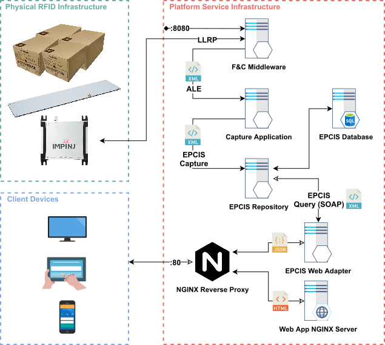

# EPCGlobal Architecture implementation for retail inventory management

A smart shelf based on UHF RFID technology, intended to be deployed in stock rooms and warehouses, which follows GS1’s EPCGlobal group of technologies, protocols and standards, to seemly integrate in global supply chain systems deployed around the globe.

This work was done for my master thesis on electronics and telecommunications engineering.
This repo contains all the material used throughout this dissertation.
The dissertation will be available for consultation after its presentation.

## Directory Organization

- `docs`: contains presentations and documentation material _(not important)_
- `dev`: contains software to evaluate and interact with the Impinj Speedway reader 
- `services`: contains the services used in the dissertation (more information on organization and how to run in [here](https://github.com/dvcorreia/epc-smart-shelve/blob/master/services/README.md))
- `tools`: contains a script to download tools needed to interact with a few of the fosstrak services

## Context

Supply chain management has evolved remarkably over the years. It became more digitized and automated, fundamentally changing how products are traded and managed. Efforts have been made in developing and establishing a collective of technologies and standards, to promote a leaner supply chain and create visibility for trading partners to control stock levels and predict market fluctuations. Even so, endeavors seem to stop at the point-of-sale supply chain integration.
This repo presents a study on RFID smart shelves applied to point of sale and retail stockroom, following technologies and standards used in supply chain, to attain a top-down integration. 

## Architecture

The Impinj Speedway R120 reader and Keonn Advantenna-p14 are attached behind the bottom shelf, radiating the entire shelf. The reader interrogates the tags, using the EPC UHF Gen2 Air Interface Protocol, following the active ROSpecs configured prior to the inventory. The inventory information is sent inside RO_ACCESS_REPORT messages to the LLRP interface of the middleware.

The Fosstrak F&C middlware receives the inventory information from the reader, processes it, following the configured ECSpecs, and periodically generates ECReports, which are sent to the ALE capture interface of the Capture Application.

The Fosstrak Capture Application receives the ECReports, contextualizes them and runs additional business logic. The contextualized data is aggregated in EPCIS event documents, following the CBV vocabulary guidelines, and is sent to the EPCIS repository.

The EPCIS repository permanently saves the EPCIS data into the EPCIS database. The EPCIS repository exposes the SOAP query interface, which can be used to retrieve information.

The managing application to visualize the smart shelf inventory, was made using web technologies. The application is served to browsers by an NGINX static file server. The browser running the application queries the data in the EPCIS repository. Modern browsers do not support SOAP natively. To mitigate this problem, the requests pass through a crude EPCIS Web Adapter, serving as proxy between web applications and the EPCIS repository. The proxy converts the SOAP XML requests into HTTP and JavaScript Object Notation (JSON) endpoints, which modern browsers natively support.

All client requests hitting the platform go through an NGINX reverse proxy. This hides the topology and characteristics of the back-end servers, removing the direct internet access to them. The services on the platform are kept inside a non-public subnet and concentrate the access control on that single point. The NGINX server also allows load balancing between services instances, which is useful when there is a need to scale the platform. The proxy also deals with cross-origin resource sharing mechanism, freeing the servers from dealing with it.

All services in the platform infrastructure are containerized using Docker, and orchestrated using Docker Compose.

## Problems and Bugs

The Fosstrak software components used in this project are not maintained. The problems caused by bugs, confusion in outdated documentation and runtime errors were the issues that took most working hours, many which could not be solved. Modern Java and Tomcat versions created breaking changes in the code, which forced the use of old versions. These old versions also did not solve all the problems, but reduced the amount of bugs to a point where the platform was working. A few major problems presented in the final platform solution will be described next.

Starting with the F&C middleware, it presents multiple problems. The web-based client is broken. The static logical reader definitions are broken. The standalone client works, but when registering LRSpecs and ECSpecs, most of the times, causes the server to break due to concurrent modification thread errors.
The capture application also presents a few problems. The connection between the ALE interface of the capture application and the middleware seems to have some issues. Using the middleware log information, it is possible to verify that the middleware processes the reports delivered by the reader, but they are not received or processed by the capture application. Further inspection on the capture application can not be done due to inexistent log files of the service. The Drools engine used by the capture application is also old with complex mechanism. Development of complex business logic was a challenge, even with support of experienced Drools users.
Regarding the EPCIS repository, the subscriptions drop EPCIS data for no apparent reason, requests are delivered in random time frames and there are problems fetching them from the current active subscriptions. The EPCIS database also has some problems with modern versions of the MySQL image.
These were the issues present in the final build of the platform. The most time consuming, by far, in this project, was to fix these type of problems, changing Java and Tomcat versions, docker images, containerization configurations, analyzing log files, configurations, to say a few.

## License and Copyrights

The license can be seen in the LICENSE file in this repository.

Copyright Disclaimer: all images and assets referent to Nespresso are their own. I do not own them. Any problem contact me at [dv.correia@ua.pt](dv.correia@ua.pt) or [dv_correia@hotmail.com](dv_correia@hotmail.com).
